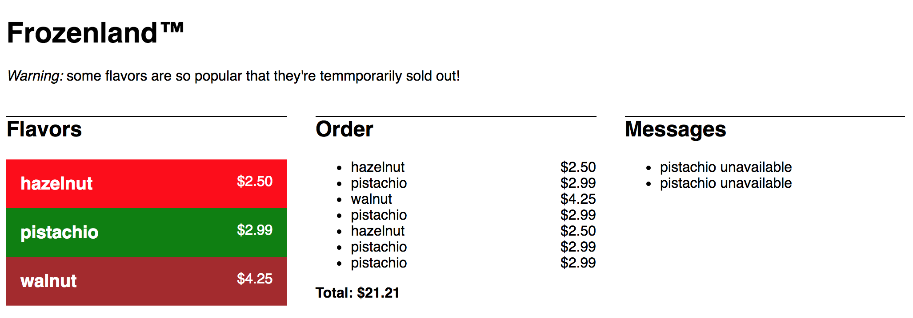

Frozenland
==========

A sample full-stack React/Express app.

Backend:

- Start with `npm start`, runs on port 5000

- Provides two routes:

  - **GET /flavors** => ``{flavors: [{name: “chocolate”, price: 5, “color”: “black”}, {name: “lime”, price: 3.50, “color: “green”}, …]}``

  - **POST /order w/JSON body of {“flavor”: “chocoalte”}** => ``{result: “unavailable” or “ordered”}``

Front End:

- Menu panel: lists all flavors, with price & color. Click an item
  tries to order that flavor.

- Order panel: lists all successful items in an order, along with a
  running total price

- Messages: lists all "unavailable" messages

When placing an order, the frontend must make a POST request to ``/order``,
as shown above, to determine whether this item was successfully ordered or
not.
